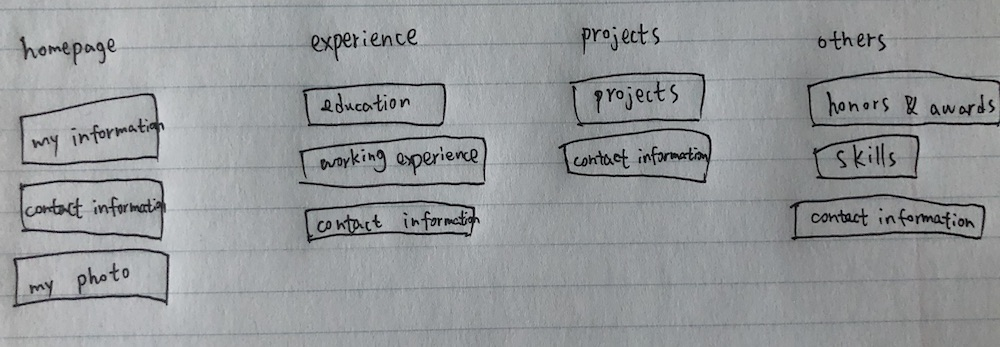
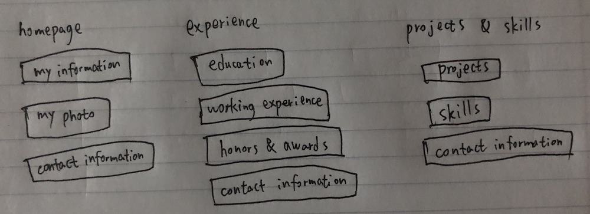

# Project 1: Design Journey

**For each milestone, complete only the sections that are labeled with that milestone.**

Be clear and concise in your writing. Bullets points are encouraged.

**Everything, including images, must be visible in Markdown Preview.** If it's not visible in Markdown Preview, then we won't grade it. We won't give you partial credit either. This is your warning.

## Audience & Content

**Make the case for your decisions using concepts from class, as well as other design principles, theories, examples, and cases from outside of class.**

You can use bullet points and lists, or full paragraphs, or a combo, whichever is appropriate. The writing should be solid draft quality but doesn't have to be fancy.

**No sketches are required for Milestone 1.**

### Website Topic (Milestone 1)
> Briefly explain what your website will be about.

My website will be about my personal information and my resume.

### Audience (Milestone 1)
> Briefly explain who the intended audience(s) is for your website. Be specific and justify why this audience is appropriate for your site's topic.

Future or potential employers interested in hiring a software engineer or web designer.

When those employers want to learn more about me and want to see something I designed and built, they will go to my website. So, they are the appropriate audiences.

### Final Content (Milestone 1)
> Briefly describe the content you plan to include in the final site, and why it's the right content for your audiences.

I plan to include my personal information, education and working experience, projects and also some interesting facts that are not on my resume.

The employers want to learn more about me, and the contents above provide those information, so the contents above are right for them.

### Home Page Content (Milestone 1)
> Briefly identify what content you will include on the homepage and why this content should be the first thing your target audience sees when they visit your site.

I will include my basic information, a section of "About Me", a photo of me, a navigation bar near the top, and contact information at the footer.

When the audiences visit my homepage, they can make sure that they are on the correct website by reading my basic information. Then a section of "About Me" and the photo will give them a general picture of me in mind. So, this content should be the first thing they see.

## Information Architecture

**Make the case for your decisions using concepts from class, as well as other design principles, theories, examples, and cases from outside of class.**

Each section is probably around 1 reasonably sized paragraph (2-4 sentences).

**No sketches are required for Milestone 2.**

### Audience (Milestone 2)
> A clearer description of audience: who are they, what are they interested in with respect to this site, and what are the design goals for that audience.

The audiences are future or potential employers interested in hiring a software engineer or web designer. They are interested in what I have accomplished and something I design and build. The design goal is to provide them with my information, experience and projects on the webpage.

### Organization & Navigation (Milestone 2)
> A description of how you generated and considered alternatives for the site's content organization and navigation. You are required to include images here of your card sorting for determining the organization of content and the navigation.

> Thoroughly document this process. The _process_ is the important part of this assignment, not the final result.]

The contents are my information, my photo, education experience, working experience, honors & awards, projects, skills and contact information. I choose these contents because they are the things that employers are most interested in.

Above is my first card sorting. Contact information is at footer so I include it for each page. Now my navigation has four pages: homepage, experience page, projects page and others page. In homepage, my information and my photo are the most related and should be the first things that audiences see as mentioned in milestone 1. In experience page, both education and working experience can be counted as experience, so I group them together. For projects page, only a list of projects is the appropriate content. Now, I have honors & awards and skills left. I think they both provide additional information but are less important than experience and projects, so I group them together as others.

Above is my second card sorting. There are two changes compared to the first one. One is that I include honors & awards in experience, because I think honors & awards are more education-related, and can be considered as part of experience. The other is that I change projects page to projects & skills page and then I include skills in the projects & skills page. I think that skills can be well demonstrated by projects, so projects and skills are highly related and can be grouped together.

I will choose the second card sorting as my final organization of content and navigation, because it is a more reasonable grouping, and contents in each group are more related.

### Final Organization and Navigation (Milestone 2)
> Explain how the final organization of content and navigation is appropriate for your target audiences.

I choose the second card sorting as my final organization of content and navigation, that is, I have three pages: homepage, experience page and projects & skills page. The target audiences are employers, and they are more interested in experience, projects and skills. Then, they can learn about my education experience, working experience and honors & awards in the experience page. And in the projects & skills page, they can learn about my projects and my skillsets.

## Visual Design

**Make the case for your decisions using concepts from class, as well as other design principles, theories, examples, and cases from outside of class.**

Remember to focus on the things we can't see just by looking at the site: changes, alternatives considered, processes, and justifications.

Each section is probably around 1 reasonably sized paragraph (2-4 sentences).

### Theme Ideas (Milestone 3)
> Discuss several ideas about styling your site's theme. Explain why the theme ideas are appropriate for your target audiences. Feel free to include some hand-drawn sketches (not digital drawings, not mock-ups, not wireframes, etc.) here to document your design process.

First theme idea is to show professionalism. Then I went to linkedin website to get some inspiration. I would use a light green background color for my header and dark blue background color for the navigation bar. And I would use a light gray background color for the main body. This color combination is similar to what is used on linkedin webpage. I think this color combination would make the webpage very neat and clean, and thus showing some professionalism. And it is appropriate for the audiences, because it increases readability for them. Also, because I have several sections, I would put some margins between them, then audiences can easily notice different sections.

The second theme idea is to use black as background color. This would show both professionalism and a cool feeling. I would use borders around each section to make the separation of sections much clear in a black background. This is also an appropriate theme idea for the audiences. They can get a sense of professionalism and the borders can let them easier to read.

### Theme Design (Milestone 3)
> Discuss your theme designs: how did you come to them, what are their strengths and weaknesses, how do they fit your overall design goals and audiences?

> Emotion is a big part of design. What emotions where you thinking about or trying to convey in your designs?

For the first theme, I would use a light green background color for my header and dark blue background color for the navigation bar. I would use a light gray background color for the main body. I then use sans-serif and gray color for the body's text because it is clearer to read. For the h3 title inside each article element, I would use dark blue color, which is consistent with the background color of navigation bar and also it will be easier to separate h3 titles from the section titles. I would also put some margins between them, then audiences can easily notice different sections.

For the second theme, I would use black as background color, white as color for text and green color for section titles. Here, I think white or green can be a contrast to black, therefore, more noticeable in a black background. I would also use sans-serif for the body. I would use borders around each section to make the separation of sections much clear in a black background.

For both themes, I would change the text-decoration for link elements in nav and footer to none if no hovering and underline otherwise. I also would make the font-size for figcaption smaller because I do not want figcaption to take up much spaces.

The first theme may be a better one, because its colors are very similar to what are used on linkedin webpage. But it does not have borders for the sections. The second theme has borders to indicate the separation of sections, but black-color theme is not very often seen in professional websites.

Because I want to show my information, experience and projects, then those themes would increase the readability for audiences and also let the audiences notice different sections more easily. So, the themes fit my overall design goals and audiences.

The emotion or feeling I want to convey is professionalism. And I think the themes above well demonstrate it.

## Rationale

**This rationale should be polished writing: one you might submit as a report to a client or boss to help explain the project and convince them you did a good job. You'll be surprised how much writing and communicating you need to do about projects and choices on internships and jobs; practice that here.**

It should be a comprehensive, complete story of the project. You might find that each section runs a few paragraphs (1-2). Sketches can often help tell the story of your design. Screenshots are also useful for describing issues discovered during the design process and how you addressed them.

**All images must be visible in Markdown Preview for credit!**

Your rationale should be a polished version of the earlier explanations.

### Site Layout (Final Submission)
> Show your design process and final layout for your site. You must include photos of your sketches of the layout. No digital drawings permitted.

> You must label each figure and provide an explanation of the sketch.

Example: (delete this) Sketch for Schedule page (version 1). Users can see a calendar of all bands planing in the main panel. I realized that the layout for the schedule may be confusing. I think separate sections for each day will work better for my audience's needs since they can focus on the bands they want to see for that day.

TODO

### Audience (Final Submission)
> A complete and polished description of the intended audience(s) for your website.

TODO

### Design Goals (Final Submission)
> An explanation of the design goals for that audience, based on your earlier rationales.

TODO

### Navigation (Final Submission)
> An explanation of how the final navigation met your goals and why its appropriate for your audience(s).

TODO

### Organization (Final Submission)
> An explanation of how the final organization met your goals and why its appropriate for your audience(s).

TODO

### Visual Design (Final Submission)
> An explanation of how the final design met your goals and why its appropriate for your audience(s).

TODO

### Self-Reflection (Final Submission)
> What did you learn from this assignment? What are some of your strengths and weaknesses?

TODO
